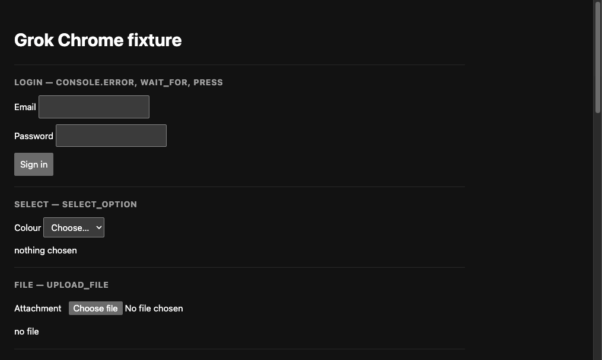

<h1 align="center">grok-chrome-mcp</h1>

<p align="center">
  <b>Give Grok Build hands in your own Chrome.</b><br>
  An MCP server + unpacked extension that lets Grok open tabs, read pages, click,
  type, run JavaScript, watch the console and network, and record what it did —
  in the browser you already use, with the sessions you are already logged into.
</p>

<p align="center">
  <a href="LICENSE"></a>
  <a href="https://www.npmjs.com/package/grok-chrome-mcp"></a>
  
  
</p>

<p align="center">
  
</p>

---

Claude has an official Chrome extension. Grok does not. This is that, for Grok
Build — 35 tools over MCP, no forked client, no second browser profile, no
`--remote-debugging-port`, no native messaging host.

- **Your real browser.** Grok works in tabs it opens in your daily Chrome, so
  your cookies and logins are just there. It never hijacks the tab you are
  looking at.
- **You can watch it work.** A *shadow mouse* — a cursor overlay drawn in the
  page — moves to whatever Grok is about to click and ripples when it does.
- **Permission per origin.** Reading is free; acting on a site needs your
  consent for that origin, and a refused action never reaches Chrome at all.
- **Debugging, not just clicking.** Console messages, network requests,
  accessibility snapshots, page text, and animated-GIF recordings of a run.
- **Chrome, Edge, Brave, Opera, Vivaldi** — connect several at once and pick
  which one Grok drives.

```
Grok Build TUI
    │  MCP stdio
    ▼
mcp-server (Node)                 in-memory origin allowlist, serial queue
    │  HTTP + WebSocket on 127.0.0.1:17352–17361
    ▼
MV3 extension  ──chrome.debugger (CDP)──▶  a tab Grok opened
```

## Quick start

```bash
npx -y grok-chrome-mcp setup
```

That prints a folder to load and the config to paste. In full:

1. **Install the extension** — run the command above, then open
   `chrome://extensions`, turn on **Developer mode**, click **Load unpacked**,
   and choose the folder it printed (`~/.grok/grok-chrome-extension`).
2. **Tell Grok about it** — add to `~/.grok/config.toml`:

   ```toml
   [mcp_servers.grok-chrome]
   command = "npx"
   args = ["-y", "grok-chrome-mcp"]
   enabled = true
   ```

3. **Restart Grok** and pin the extension. Its popup goes from
   `waiting for Grok` to `connected`.

Then just ask, in the TUI:

> open localhost:3000, sign in as test@example.com, and tell me what the
> console says

Grok will ask before it touches the site the first time.

## From source


```bash
git clone https://github.com/dietghardev/grok-chrome-mcp.git
cd grok-chrome-mcp/mcp-server && npm install && npm run build && npm test
```

Load `extension/` unpacked as above, and point Grok at the build:

```toml
[mcp_servers.grok-chrome]
command = "node"
args = ["/absolute/path/to/grok-chrome-mcp/mcp-server/dist/index.js"]
```

Edge, Brave, Opera, and Vivaldi work too — load the same folder there. Every
connected browser registers itself; `chrome_browsers` lists them and
`chrome_select_browser` picks which one later tools drive.

## Tools

**Permission model.** Reading is free; acting on a page needs the user's
consent for that origin. A mutating tool called on an ungranted origin returns
`needs_permission` and sends **nothing** to Chrome — Grok is expected to ask
you in chat, then call `chrome_grant_site`. Grants live in the MCP process's
memory only: they never touch disk and die when Grok exits. `localhost:3000`,
`localhost:5173`, and `127.0.0.1:3000` are three separate grants.

| Read-only — no grant | |
|---|---|
| `chrome_tabs` | open tabs and the current target |
| `chrome_page` | target tab's URL and title |
| `chrome_snapshot` | accessibility tree with refs (`e1`, `e2`, …), field values, and disabled/checked/focused state |
| `chrome_find` | elements by text and/or role, sharing snapshot's ref numbering |
| `chrome_text` | visible page text, capped and flagged when truncated |
| `chrome_screenshot` | viewport PNG |
| `chrome_console` | recent console messages, filterable by level |
| `chrome_network` | recent finished requests (no bodies) |
| `chrome_wait_for` | wait for text to appear or disappear |
| `chrome_browsers` | connected browsers |
| `chrome_resize` | resize so the viewport matches a size |
| `chrome_cursor` | show/hide the shadow mouse |
| `chrome_record_start` / `chrome_record_stop` | record the tab to an animated GIF |

| Needs a grant | |
|---|---|
| `chrome_navigate`, `chrome_new_tab` (with a URL) | go somewhere |
| `chrome_back`, `chrome_forward`, `chrome_reload` | history |
| `chrome_click`, `chrome_hover`, `chrome_drag`, `chrome_scroll` | pointer |
| `chrome_type`, `chrome_fill`, `chrome_press` | keyboard, including `Control+a` / `Meta+Shift+p` |
| `chrome_select_option`, `chrome_upload_file` | forms |
| `chrome_evaluate` | run JavaScript in the page |
| `chrome_close_tab` | free for Grok's own tabs; a grant for yours |
| `chrome_batch` | a short sequence in one round-trip; each step is permission-checked as if called alone |

Housekeeping: `chrome_grant_site`, `chrome_revoke_site`, `chrome_use_tab`,
`chrome_select_browser`.

Refs come from `chrome_snapshot` or `chrome_find` and belong to the newest
snapshot of that tab; an older ref returns `stale_ref` rather than clicking
whatever now sits in that position.

## Manual fixture pass

```bash
npx --yes serve mcp-server/fixture -p 4173
```

In Grok: grant `http://localhost:4173`, then open it and work through the
sections — sign in and read `login failed` from the console, wait for
`Welcome back`, choose a colour, hover, drag the chip into the drop zone,
scroll to the bottom, and record a GIF of the run.

Then: quit Chrome mid-session — the next tool call reports
`extension_disconnected` immediately rather than hanging. Reopen Chrome and it
reconnects on its own.

## Errors

Every failure is one of these codes, as JSON the model can act on:
`extension_disconnected`, `bridge_bind_failed`, `no_tab`, `blocked_origin`,
`needs_permission`, `invalid_origin`, `invalid_input`, `stale_ref`, `timeout`,
`debugger_failed`.

## Safety

- The bridge binds `127.0.0.1` only. Any process on this Mac can still reach
  that port — the same class of risk as a token under `~/.grok/`.
- `chrome://`, `chrome-extension://`, `edge://`, and the Web Store are refused
  outright, for reading as well as acting.
- Grok works in tabs it opened (grouped under **Grok**) unless you point it at
  one of yours with `chrome_use_tab` — and even then, acting still needs the
  grant.
- `chrome_evaluate` and `chrome_upload_file` are the sharp ones: the first runs
  arbitrary JavaScript in the page, the second hands local files to it. Both
  need a grant; only pass file paths you chose.
- Page content is untrusted input. Snapshots and screenshots can carry prompt
  injection, so don't grant origins you don't trust — there is no second
  classifier here.

## Contributing

Issues and pull requests welcome — see [CONTRIBUTING.md](CONTRIBUTING.md).
Security reports go through [private advisories](SECURITY.md), not public
issues.

## Development

```bash
cd mcp-server
npm test            # 109 unit tests
npm run smoke       # bridge protocol + MCP stdio surface, no Chrome needed
npm run build
```

### End-to-end

`npm run e2e` drives a real browser through the whole tool surface against the
fixture — permission gating, snapshot, fill, click, wait, console, network,
select, evaluate, keyboard, screenshot, GIF, blocked origins, tab close.

Google Chrome stable refuses `--load-extension`, so pick a mode:

```bash
# Drive a browser that already has the extension loaded. Opens one localhost
# tab and closes it; a browser it did not launch is otherwise never commanded.
E2E_USE_CONNECTED=1 npm run e2e

# Or launch an isolated browser, given a binary that still allows it.
CHROME_PATH=/path/to/chromium npm run e2e
```

The connected mode requires the loaded extension to match this tree's version —
after editing `extension/`, hit reload (↻) on the card at `chrome://extensions`
or the run will tell you to.

The pure logic the extension depends on lives in `extension/lib/` (`keys.js`,
`ax.js`) so it is unit-tested alongside the server rather than only being
exercised by hand in a browser.

## License

MIT — see [LICENSE](LICENSE).
